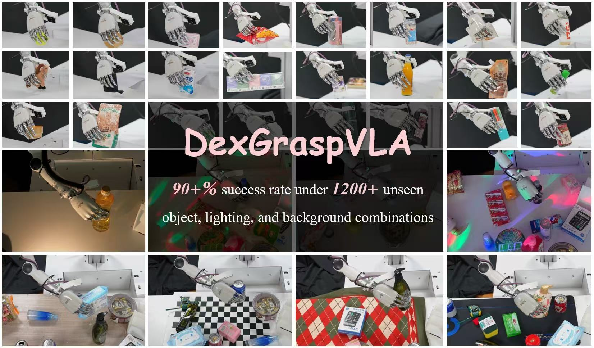
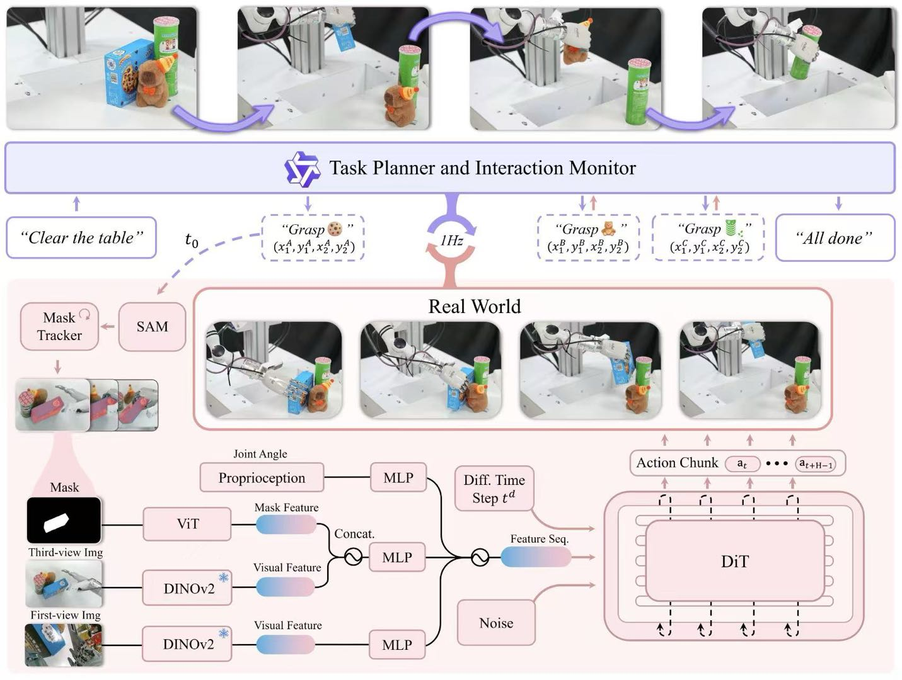
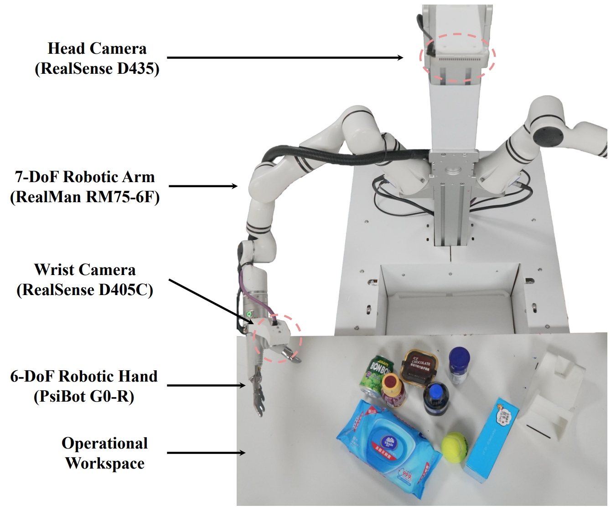

<h1 align="center"> DexGraspVLA: A Vision-Language-Action Framework Towards General Dexterous Grasping </h1>


### 📝 [Paper](https://arxiv.org/abs/2502.20900) | 🌍 [Project Page](https://dexgraspvla.github.io/) | 📺 [Video](https://www.youtube.com/watch?v=X0Sq7q-bfI8)





**DexGraspVLA** is a **hierarchical vision-language-action framework** that reaches a **90+\%** success rate in **dexterous grasping in cluttered scenes** under **thousands** of **unseen** object, lighting, and background combinations in a "**zero-shot**" real-world environment. It can also complete **long-horizon grasping tasks** that require **complex vision-language reasoning**. The framework utilizes a pre-trained vision-language model as the high-level task planner and learns a diffusion-based policy as the low-level action controller. Its key insight lies in leveraging foundation models for strong generalization and using diffusion-based imitation learning for acquiring dexterous actions.




# Environment Setup

First, please create and activate the conda environment:
```bash
conda create -n dexgraspvla python=3.9
conda activate dexgraspvla
git clone https://github.com/Psi-Robot/DexGraspVLA.git
cd DexGraspVLA
pip install -r requirements.txt
```

Then, please install [SAM](https://github.com/facebookresearch/segment-anything) and [Cutie](https://github.com/hkchengrex/Cutie) following the official instructions.

The CUDA version we use is 12.6.

# DexGraspVLA Controller

## Prepare Dataset

We provide a tiny [dataset](https://drive.google.com/file/d/1Z4QIibZwudz_qUazAGQAF7lAFAoRROnK/view?usp=drive_link) containing 51 human demonstration data samples, allowing users to understand the content and format of our data, as well as run the code to get a hands-on experience of the training process. 

First, create a `data` folder under the repo root:

```bash
[DexGraspVLA]$ mkdir data && cd data
```

Download the dataset and put it in the `data` folder. Then, decompress the dataset:

```bash
[data]$ tar -zxvf grasp_demo_example.tar.gz && rm -rf grasp_demo_example.tar.gz
```

## Launch Training

To train the DexGraspVLA controller on a single GPU, run

```
python train.py --config-name train_dexgraspvla_controller_workspace
```

To train the DexGraspVLA controller on 8 GPUs, first configure [accelerate](https://huggingface.co/docs/accelerate/index) with `accelerate config`, where we enable BF16 mixed precision training, and then run `./train.sh` or 

```
accelerate launch --num_processes=8 train.py --config-name train_dexgraspvla_controller_workspace
```

Users can also start from an existing checkpoint by specifying `policy.start_ckpt_path` in `controller/config/train_dexgraspvla_controller_workspace.yaml`. To support application and fine-tuning, we provide an open-source, high-performing model checkpoint ([dexgraspvla-controller-20250320](https://drive.google.com/file/d/1ge1FYD2wUqBnFewWzpsjQ5v6pEDBraOH/view?usp=sharing)), which has been deployed and evaluated across five zero-shot locations at the time of release, demonstrating strong generalization capabilities. Additionally, other training settings can also be customized by modifying the configuration files in the `controller/config` folder.

To help understand the internal model behaviors, we provide the functionality to generate, save, and visualize the attention maps of the controller. To enable this, please set `gen_attn_map` to `True` in the config file before training. During each sampling step, the attention maps will be saved as pickle files in the `train_sample_attn_maps` folder under the experiment directory. To visualize them, please run `python attention_map_visualizer.py --attn_maps_dir <path to train_sample_attn_maps>`. This will generate the images of attention maps under newly-created folders inside `train_sample_attn_maps` with the same names as the corresponding pickle files.


# DexGraspVLA Planner


We provide the code for the DexGraspVLA planner based on [Qwen2.5-VL-72B-Instruct](https://huggingface.co/Qwen/Qwen2.5-VL-72B-Instruct) in the `planner` directory. Our interface currently supports calling the API or querying a deployed model on cloud servers.

```python
# Instantiate a planner that calls the API
planner = DexGraspVLAPlanner(
    api_key="your_api_key",
    base_url="https://dashscope.aliyuncs.com/compatible-mode/v1",
    model_name="qwen2.5-vl-72b-instruct"
)

# Instantiate a planner that queries a deployed model
planner = DexGraspVLAPlanner(
    base_url="your_deployed_model_url"
)
```

For deployment, we utilize an 8-A800 GPU server to host the Qwen2.5-VL-72B-Instruct model. The deployment is managed using vllm version 0.7.3, leveraging the Qwen2.5-VL-7B-Instruct model for speculative decoding. The deployment process utilizes four GPUs.

The following command is used to deploy the model:

```bash
python -m vllm.entrypoints.openai.api_server --host 0.0.0.0 --port 8001 \
 --model <path to Qwen2.5-VL-72B-Instruct> --seed 42 -tp 1 \
 --speculative_model <path to Qwen2.5-VL-7B-Instruct> --num_speculative_tokens 5 \
 --gpu_memory_utilization 0.9 --tensor-parallel-size 4
```


# DexGraspVLA Inference

The hardware platform we use for dexterous grasping is shown in the following figure.

<div align="center">  </div>

Due to intellectual property constraints, we are unable to open-source the hardware-related code. However, we have released the rest of the code for reference, and below, we provide instructions on how to run DexGraspVLA on this platform.

## Installation

First, install the required dependencies:

```
pip install pymodbus==2.5.3 pyrealsense2==2.55.1.6486
```

## Configuration

### 1. Hardware Setup:
Configure the hardware settings in `inference_utils/config.yaml`.

### 2. Controller Checkpoint:
Specify the trained controller model checkpoint in `controller/config/train_dexgraspvla_controller_workspace.yaml`.
Alternatively, users can use our pre-trained checkpoint for quick deployment:
[dexgraspvla-controller-20250320](https://drive.google.com/file/d/1ge1FYD2wUqBnFewWzpsjQ5v6pEDBraOH/view?usp=sharing).

## Customizing the Inference Command
Modify `inference.sh` by adjusting the following arguments based on users' needs:

- `--manual`: Enables manual mode, allowing users to manually mark the bounding box, monitor the grasping process, and reset when necessary. If omitted, the full DexGraspVLA planner is used, leveraging a vision-language model (VLM) to plan and monitor the grasping trajectory autonomously.
- `--save_deployment_data`: Saves rollout data from the inference episodes, including raw data and recorded videos.
- `--gen_attn_map`: Generates and saves attention maps from the controller.

## Running the Inference
Once everything is set up, start the inference process with the following command:

```bash
./inference.sh
```

This command executes the configured grasping pipeline on the specified hardware platform.

During execution, detailed logs are generated and stored in the `logs` directory. These logs include:

- **Pipeline status** – real-time updates on the grasping process
- **Camera images** – captured frames from the execution
- **Planner prompts & responses** – inputs and outputs from the vision-language model (VLM)
- **Optional data** – attention maps and rollout data, if enabled

Example logs can be downloaded here.


# Citation

If you find our project helpful, please consider citing it as

```bibtex
@misc{zhong2025dexgraspvla,
      title={DexGraspVLA: A Vision-Language-Action Framework Towards General Dexterous Grasping}, 
      author={Yifan Zhong and Xuchuan Huang and Ruochong Li and Ceyao Zhang and Yitao Liang and Yaodong Yang and Yuanpei Chen},
      year={2025},
      eprint={2502.20900},
      archivePrefix={arXiv},
      primaryClass={cs.RO},
      url={https://arxiv.org/abs/2502.20900}, 
}
```


# Acknowledgements

This codebase is based on [Diffusion Policy](https://github.com/real-stanford/diffusion_policy), [RDT](https://github.com/thu-ml/RoboticsDiffusionTransformer), [DiT](https://github.com/facebookresearch/DiT), and [pi_zero_pytorch](https://github.com/lucidrains/pi-zero-pytorch/).
