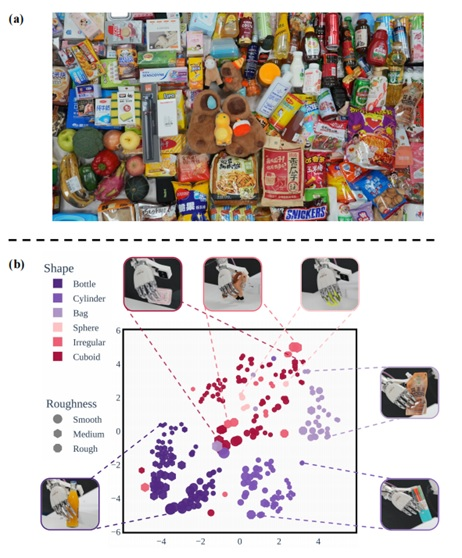

<h1 align="center"> DexGraspVLA: A Vision-Language-Action Framework Towards General Dexterous Grasping </h1>

### 📝 [Paper](https://arxiv.org/abs/2502.20900) | 🌍 [Project Page](https://dexgraspvla.github.io/) | 📺 [Video](https://www.youtube.com/watch?v=X0Sq7q-bfI8)

---

# 🌟 简介 (Introduction)

DexGraspVLA 是一个创新的**分层式视觉-语言-动作 (Vision-Language-Action, VLA) 框架**，致力于解决机器人**通用灵巧抓取**的难题。它能够在包含数千种**未见过**的物体、光照和背景组合的复杂真实世界环境中，实现**超过 90%** 的灵巧抓取成功率，尤其擅长处理**杂乱场景**和理解**复杂的自然语言指令**。


*DexGraspVLA 在超过1200种未见过的物体、光照和背景组合下展现出超过90%的抓取成功率。*

---

# 🎯 研究目标与挑战 (Goals and Challenges)

通用的灵巧抓取是机器人实现复杂操作的关键，但在现实环境中面临巨大挑战：

*   **物体多样性**: 物体种类繁多，形状、大小、材质各异。
*   **环境多变性**: 光照条件、背景杂乱程度不断变化。
*   **任务复杂性**: 需要理解并执行包含复杂语义的自然语言指令。

DexGraspVLA 旨在克服这些挑战，提出一个具备以下特点的系统：

1.  **强大的零样本泛化能力**: 无需针对新环境进行额外训练即可成功抓取。
2.  **复杂的语言理解与推理**: 能够理解并执行如“清理桌面”等长时序、多步骤的指令。
3.  **模块化与可扩展性**: 采用分层设计，易于训练、调试和功能扩展。


*DexGraspVLA 需要应对未见过的物体、光照和背景组合。*

---

# 💡 方法框架 (Methodology)

DexGraspVLA 采用**分层架构**，有效结合了大型基础模型的理解能力和特定任务策略的执行能力：

1.  **高层任务规划器 (Planner)**: 利用预训练的**视觉语言大模型 (VLM)**（如 Qwen-VL），负责理解用户输入的自然语言指令，结合视觉场景信息，进行任务分解和目标物体的**视觉定位 (Grounding)**，输出目标物体的边界框 (Bounding Box)。
2.  **底层动作控制器 (Controller)**: 基于**扩散模型 (Diffusion Policy)**，学习从**多视角视觉特征** (头部相机和腕部相机) 和**本体感受信息**到**灵巧手动作**的映射。它接收 Planner 提供的目标信息，并生成平滑、精确的闭环抓取动作序列。


*DexGraspVLA 的分层框架：Planner 进行理解和规划，Controller 生成具体动作。*

## 任务规划器 (Planner) 详解

Planner 的核心是将用户的模糊指令转化为机器人可执行的明确目标。

*   **输入**: 自然语言指令 (如 "清理桌子上的物体") 和头部相机拍摄的场景图像。
*   **处理**:
    *   **任务理解与分解**: VLM 分析指令意图，将其分解为一系列抓取子任务 (如 "抓取红色袋子", "抓取黑色可乐")。
    *   **视觉定位**: VLM 在图像中定位每个子任务对应的目标物体，并输出其边界框坐标 `(x1, y1, x2, y2)`。
    *   **抓取顺序规划与监控**: Planner 会根据机械臂位置、物体可达性、潜在碰撞等因素规划最优抓取顺序，并在执行过程中持续监控抓取状态，进行必要的调整或反馈。
*   **输出**: 按顺序排列的目标物体边界框列表。


*Planner 利用 VLM 将语言指令 (如 "the black Coca Cola") 定位到图像中的具体物体，并生成边界框。*


*Planner 判断用户指令类型，并进行相应的处理流程。*


*Planner 根据指令和场景信息，生成抓取计划或进行状态检查。*

## 动作控制器 (Controller) 详解

Controller 负责将 Planner 的规划转化为实际的物理动作。

*   **输入**: 融合后的多模态观测信息，包括：
    *   头部相机视觉特征 (DINOv2)
    *   腕部相机视觉特征 (DINOv2)
    *   目标物体掩码特征 (ViT)
    *   机器人本体状态 (关节角度等)
*   **处理**:
    *   **特征融合**: 使用 MLP 将不同来源的特征映射到统一空间。
    *   **动作生成**: 基于 Diffusion Transformer (DiT) 结构，预测未来一段时间的动作序列 (手臂关节 + 手指关节)。采用 Receding Horizon 控制策略，逐步执行并重新规划，提高实时性和鲁棒性。
*   **输出**: 驱动灵巧手和机械臂执行抓取的动作指令。


*控制器使用的主要符号及其维度说明。*

---

# 🛠️ 硬件平台 (Hardware Platform)

实验平台主要由以下部分组成：

*   **机械臂**: 7自由度 RealMan RM75-6F
*   **灵巧手**: 6自由度 PsiBot GO-R
*   **视觉系统**: RealSense D435 (头部相机) + RealSense D405C (腕部相机)


*DexGraspVLA 使用的硬件平台示意图。*

---

# 📊 实验结果 (Experiments & Results)

DexGraspVLA 在多种具有挑战性的场景下进行了广泛评估，展现了卓越的性能。

## 强泛化能力验证

在包含 **360** 种未见物体、**6** 种未见背景、**3** 种未见光照，共 **1287** 种组合的测试场景中：

*   **单次尝试成功率 (Ours@1)**: 达到 **90.8%**。
*   **三次尝试成功率 (Ours@3)**: 高达 **96.9%**。


*在未见过的物体、背景、光照组合下的泛化性能。*


*泛化能力测试中的物体多样性（形状、粗糙度）可视化。*

## 零样本抓取性能

在包含已知和未知物体的零样本场景中，DexGraspVLA (Ours@1) 相比基线方法取得了显著提升，尤其是在处理未见过的物体时。


*零样本抓取任务中的成功率对比。*


*零样本抓取任务中的成功率柱状图对比。*

## 边界框预测与注意力鲁棒性

即使在背景或光照存在干扰的情况下，Planner 也能准确预测目标边界框 (准确率 > 99%)，Controller 的注意力机制能够始终聚焦于目标物体。


*在不同干扰条件下，边界框预测和注意力热图保持稳定和准确。*

## 大规模未见环境评估

进一步的评估覆盖了更广泛、更贴近现实的未见环境组合，结果再次验证了 DexGraspVLA 的高成功率和强泛化能力。


*在 1287 种大规模组合测试场景下的详细成功率。*


*大规模未见环境评估中使用的部分场景示例。*

---

# 📜 引用 (Citation)

如果 DexGraspVLA 的项目对您有帮助，请考虑引用：

```bibtex
@misc{zhong2025dexgraspvla,
      title={DexGraspVLA: A Vision-Language-Action Framework Towards General Dexterous Grasping},
      author={Yifan Zhong and Xuchuan Huang and Ruochong Li and Ceyao Zhang and Yitao Liang and Yaodong Yang and Yuanpei Chen},
      year={2025},
      eprint={2502.20900},
      archivePrefix={arXiv},
      primaryClass={cs.RO},
      url={https://arxiv.org/abs/2502.20900},
}
```

# Acknowledgements

This codebase is based on [Diffusion Policy](https://github.com/real-stanford/diffusion_policy), [RDT](https://github.com/thu-ml/RoboticsDiffusionTransformer), [DiT](https://github.com/facebookresearch/DiT), and [pi_zero_pytorch](https://github.com/lucidrains/pi-zero-pytorch/).